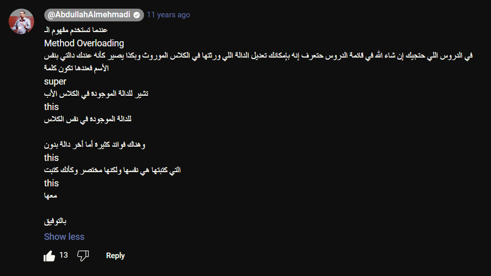

# OOP

## 1- Inheritance

> Class Main

```java
package inheritance;

public class Main {
    public static void main(String[] args) {

       C c = new C();

       c.printA();
       c.printB();
       c.printC();

    }
}
```

> Class A

```java
package inheritance;

/*
Class A is Direct SuperClass for Class B
Class A is Indirect SuperClass for Class C
 */
public class A {

    public void printA(){
        System.out.println("Class A");
    }
}
```

> Class B

```java
package inheritance;

/*
Class B is Direct SuperClass for Class C
Class B is Direct SubClass for Class A
 */
public class B extends A {

    public void printB(){
        System.out.println("Class B");
    }
}
```

> Class C

```java
package inheritance;

/*
Class C is Direct SubClass for Class B
Class C is Indirect SubClass for Class A
 */
public class C extends B {

    public void printC() {
        System.out.println("Class C");
    }
}
```

----

## Super or This



> Class Main

```java
package inheritance;

public class Main {
    public static void main(String[] args) {

       C c = new C();

       c.printC();

    }
}
```

> Class A

```java
package inheritance;

public class A {

    public void printA(){
        System.out.println("Class A");
    }
}
```

> Class B

```java
package inheritance;

public class B extends A{

    public void printB(){
        System.out.println("Class B");
    }
}
```

> Class C

```java
package inheritance;

public class C extends B {

    public void printC() {
        System.out.println("Class C");
        super.printB();
        this.printA();
    }
}
```

----

## multiple constructor


> Class Main

```java
package inheritance;

public class Main {

    public static void main(String[] args){

        A a1 = new A();
        A a2 = new A(12);
        A a3 = new A(10, 5);
        A a4 = new A("Ali");

        System.out.println(a1.value);
        System.out.println(a2.value);
        System.out.println(a3.value);
        System.out.println(a4.str);


    }
}
```

> Class A

```java
package inheritance;

public class A {

    public int value ;
    public String str ;

    public A(){
        this.value = 0;
    }
    public A(int c){
        this.value = c;
    }
    public A(int n1, int n2){
        this.value = n1 * n2;
    }

    public A(String s){
        this.str = s;
    }

    public void printA(){
        System.out.println("Class A");
    }
}
```
